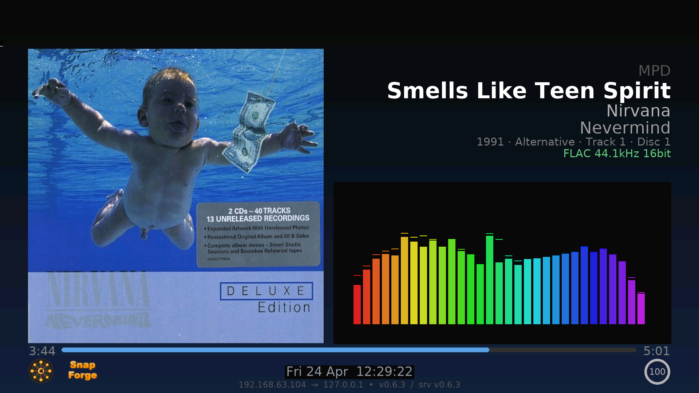

🇬🇧 [English](README.md) | 🇮🇹 **Italiano**

# snapMULTI - Server Audio Multiroom

[](https://github.com/lollonet/snapMULTI/actions/workflows/validate.yml)
[](https://github.com/lollonet/snapMULTI/releases/latest)
[](https://hub.docker.com/r/lollonet/snapmulti-server)
[](https://paypal.me/lolettic)
[](LICENSE)

Licenza: `GPL-3.0-only`

Riproduci musica in sincronia in ogni stanza. Streaming da Spotify, AirPlay, la tua libreria musicale o qualsiasi app — tutti gli altoparlanti suonano insieme.

<p align="center">
  
  <br>
  <em>Display HDMI: copertina, analizzatore di spettro, metadati brano — rendering diretto su framebuffer, nessun desktop</em>
</p>

## Sorgenti

| Sorgente | Come |
|----------|------|
| **Spotify** | Apri l'app → seleziona "*hostname* Spotify" (Premium) |
| **AirPlay** | Icona AirPlay → seleziona "*hostname* AirPlay" |
| **Tidal** | Apri l'app → cast su "*hostname* Tidal" (solo ARM/Pi) |
| **Libreria musicale** | Naviga su `http://hostname.local:8180` |
| **Qualsiasi app** | Stream sulla porta 4953 ([dettagli](docs/SOURCES.it.md#5-ingresso-tcp-tcp-server)) |

Gestisci gli altoparlanti su `http://hostname.local:1780`

## Avvio Rapido

**[QUICKSTART.it.md](QUICKSTART.it.md)** — da zero alla musica in 5 minuti.

### Raspberry Pi (principianti)

```bash
# Flasha la SD con Pi Imager (64-bit Lite, imposta hostname/WiFi/SSH)
# Reinserisci la SD, poi:
git clone https://github.com/lollonet/snapMULTI.git
./snapMULTI/scripts/prepare-sd.sh
# Inserisci la SD nel Pi, accendi, attendi ~10 min
```

### Qualsiasi Linux (avanzato)

```bash
git clone https://github.com/lollonet/snapMULTI.git && cd snapMULTI
sudo ./scripts/deploy.sh   # oppure: cp .env.example .env && docker compose up -d
```

## Aggiungi Altoparlanti

Flasha un'altra SD → scegli "Audio Player" → inseriscila in un altro Pi. Trova il server automaticamente.

Oppure installa snapclient su qualsiasi Linux: `sudo apt install snapclient`

## Aggiornamento

Riflasha la SD con l'ultima versione — tutta la configurazione viene auto-rilevata.

Per preservare l'indice della libreria musicale: `./scripts/backup-from-sd.sh` prima del flash.
Vedi [Guida all'Uso — Aggiornamento](docs/USAGE.it.md#aggiornamento) per opzioni avanzate.

## Documentazione

| Guida | Contenuto |
|-------|-----------|
| **[Guida Rapida](QUICKSTART.it.md)** | Installazione in una pagina — da zero alla musica in 5 minuti |
| [Installazione](docs/INSTALL.it.md) | Passo-passo completo con risoluzione problemi |
| [Hardware](docs/HARDWARE.it.md) | Modelli Pi, DAC HAT, rete, combinazioni testate |
| [Uso e Operazioni](docs/USAGE.it.md) | Architettura, servizi, MPD, mDNS, aggiornamento |
| [Sorgenti Audio](docs/SOURCES.it.md) | Configurazione sorgenti, parametri, API JSON-RPC |
| [Changelog](CHANGELOG.md) | Cronologia versioni |

## Ringraziamenti

Costruito su [Snapcast](https://github.com/badaix/snapcast) (Johannes Pohl), [go-librespot](https://github.com/devgianlu/go-librespot) (devgianlu), [shairport-sync](https://github.com/mikebrady/shairport-sync) (Mike Brady), [MPD](https://www.musicpd.org/), [myMPD](https://github.com/jcorporation/myMPD) (jcorporation), [tidal-connect](https://github.com/edgecrush3r/tidal-connect-docker) (edgecrush3r).
