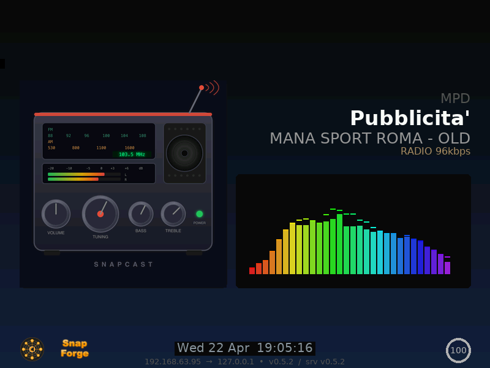

🇬🇧 **English** | 🇮🇹 [Italiano](README.it.md)

# snapMULTI - Multiroom Audio Server

[](https://github.com/lollonet/snapMULTI/actions/workflows/validate.yml)
[](https://github.com/lollonet/snapMULTI/releases/latest)
[](https://hub.docker.com/r/lollonet/snapmulti-server)
[](https://paypal.me/lolettic)
[](LICENSE)

Play music in sync across every room. Stream from Spotify, AirPlay, your music library, or any app — all speakers play together.


*HDMI display: cover art, spectrum analyzer, network info — rendered directly to framebuffer*

## Sources

| Source | How |
|--------|-----|
| **Spotify** | Open app → select "*hostname* Spotify" (Premium) |
| **AirPlay** | AirPlay icon → select "*hostname* AirPlay" |
| **Tidal** | Open app → cast to "*hostname* Tidal" (ARM/Pi only) |
| **Music library** | Browse at `http://hostname.local:8180` |
| **Any app** | Stream to port 4953 ([details](docs/SOURCES.md#5-tcp-input-tcp-server)) |

Manage speakers at `http://hostname.local:1780`

## Quick Start

**[QUICKSTART.md](QUICKSTART.md)** — zero to music in 5 minutes.

### Raspberry Pi (beginners)

```bash
# Flash SD with Pi Imager (64-bit Lite, set hostname/WiFi/SSH)
# Re-insert SD, then:
git clone https://github.com/lollonet/snapMULTI.git
./snapMULTI/scripts/prepare-sd.sh
# Insert SD in Pi, power on, wait ~10 min
```

### Any Linux (advanced)

```bash
git clone https://github.com/lollonet/snapMULTI.git && cd snapMULTI
sudo ./scripts/deploy.sh   # or: cp .env.example .env && docker compose up -d
```

## Add Speakers

Flash another SD → choose "Audio Player" → insert in any Pi. Auto-discovers the server.

Or install snapclient on any Linux: `sudo apt install snapclient`

## Updating

Reflash the SD card with the latest version — all config is auto-detected.

To preserve your music library index: `./scripts/backup-from-sd.sh` before flashing.
See [Usage Guide — Updating](docs/USAGE.md#updating) for advanced options.

## Documentation

| Guide | What's inside |
|-------|---------------|
| **[Quick Start](QUICKSTART.md)** | One-page install — zero to music in 5 minutes |
| [Installation](docs/INSTALL.md) | Complete step-by-step with troubleshooting |
| [Hardware](docs/HARDWARE.md) | Pi models, DAC HATs, network, tested combinations |
| [Usage & Ops](docs/USAGE.md) | Architecture, services, MPD, mDNS, updating |
| [Audio Sources](docs/SOURCES.md) | Source config, parameters, JSON-RPC API |
| [Changelog](CHANGELOG.md) | Version history |

## Acknowledgments

Built on [Snapcast](https://github.com/badaix/snapcast) (Johannes Pohl), [go-librespot](https://github.com/devgianlu/go-librespot) (devgianlu), [shairport-sync](https://github.com/mikebrady/shairport-sync) (Mike Brady), [MPD](https://www.musicpd.org/), [myMPD](https://github.com/jcorporation/myMPD) (jcorporation), [tidal-connect](https://github.com/edgecrush3r/tidal-connect-docker) (edgecrush3r).
