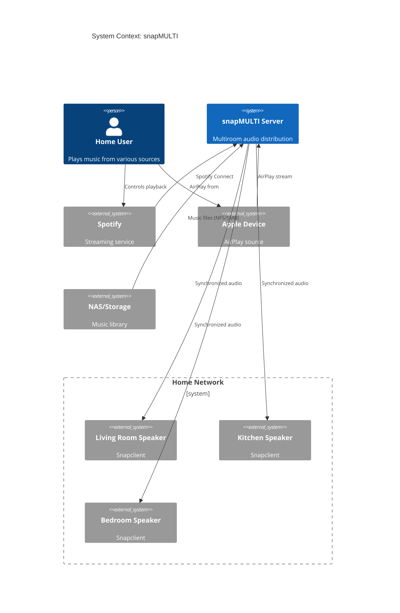

# ARC-001: System Context and Boundaries

## Context Diagram

## System Boundaries

### Inside the System
- Snapcast server (audio distribution)
- MPD (local music playback)
- Librespot (Spotify Connect)
- Shairport-sync (AirPlay)
- myMPD (web interface)
- Tidal bridge (optional)

### Outside the System
- Snapcast clients (separate installation)
- Music storage (NAS, USB drive)
- Streaming services (Spotify, Tidal)
- Apple devices (AirPlay sources)
- Network infrastructure (router, WiFi)

## Quality Attributes

| Attribute | Target | Rationale |
|-----------|--------|-----------|
| Sync accuracy | <10ms | Imperceptible audio delay |
| Startup time | <5 min | Usable shortly after boot |
| Availability | 99% uptime | Home audio should always work |
| Recovery | Auto-restart | No manual intervention needed |
