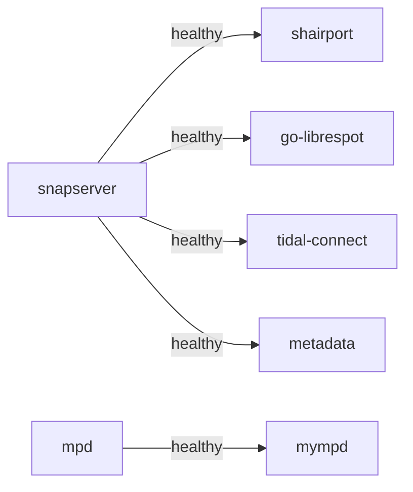

# ARC-002: Container Architecture

## Container Diagram

```mermaid
flowchart TB
    subgraph "snapMULTI Server"
        subgraph "Audio Sources"
            mpd[MPD Container<br/>Port 6600]
            golibrespot[go-librespot Container<br/>Spotify Connect]
            shairport[Shairport-sync Container<br/>AirPlay]
            tidal[Tidal Connect Container<br/>ARM only]
        end

        subgraph "Audio Distribution"
            snapserver[Snapserver Container<br/>Ports 1704, 1705, 1780]
        end

        subgraph "Web Interfaces"
            mympd[myMPD Container<br/>Port 8180]
            metadata[Metadata Service<br/>WS 8082 / HTTP 8083]
        end

        subgraph "Shared Storage"
            audio[/audio/<br/>FIFO pipes]
            music[/music/<br/>Music library]
            config[/config/<br/>Configuration]
        end
    end

    mpd --> |snapcast_fifo| audio
    golibrespot --> |spotify_fifo| audio
    shairport --> |airplay_fifo| audio
    tidal --> |tidal_fifo| audio
    audio --> snapserver

    music --> mpd
    config --> mpd
    config --> snapserver
    config --> shairport

    mympd --> |MPD protocol| mpd
    metadata --> |JSON-RPC 1780| snapserver

    client1[Snapclient 1] --> |TCP 1704| snapserver
    client2[Snapclient 2] --> |TCP 1704| snapserver
```

## Container Communication

### Named Pipes (FIFOs)
Audio sources write raw PCM to named pipes in `/audio/`:

| Pipe | Source | Format |
|------|--------|--------|
| snapcast_fifo | MPD | 44100:16:2 |
| spotify_fifo | go-librespot | 44100:16:2 |
| airplay_fifo | Shairport-sync | 44100:16:2 |
| tidal_fifo | Tidal Connect | 44100:16:2 |

### Network Ports

| Port | Service | Protocol | Purpose |
|------|---------|----------|---------|
| 1704 | Snapserver | TCP | Audio streaming to clients |
| 1705 | Snapserver | TCP | Control protocol |
| 1780 | Snapserver | HTTP | Snapweb UI + JSON-RPC API |
| 6600 | MPD | TCP | MPD control protocol |
| 8000 | MPD | HTTP | Direct HTTP stream |
| 8082 | Metadata | WebSocket | Track info push to clients |
| 8083 | Metadata | HTTP | Cover art + health check |
| 8180 | myMPD | HTTP | Web interface |
| 8888 | Tidal Connect | WebSocket | Tidal playback events (internal) |
| 24879 | go-librespot | WebSocket | Spotify playback events (internal) |

### Service Dependencies



## Volume Mounts

| Host Path | Container Path | Mode | Purpose |
|-----------|----------------|------|---------|
| ./audio | /audio | rw | FIFO pipes |
| ./config | /config | ro | Configuration files |
| ./data | /data | rw | Persistent data |
| $MUSIC_PATH | /music | ro | Music library |
| /run/dbus | /run/dbus | rw | D-Bus for mDNS |
