# ARC-003: Deployment Architecture

## Deployment Paths

```mermaid
flowchart TB
    subgraph "Beginner Path (Zero-Touch)"
        flash[Flash Pi OS to SD] --> prep[prepare-sd.sh on host]
        prep --> boot[Insert SD, power on Pi]
        boot --> firstboot[firstboot.sh runs automatically]
        firstboot --> deploy[deploy.sh]
        deploy --> running[All services running]
    end

    subgraph "Advanced Path (Manual)"
        clone[git clone on Linux host] --> manual_deploy[deploy.sh]
        manual_deploy --> manual_running[All services running]
    end

    subgraph "CI/CD Path"
        tag[Git tag v*] --> build[GitHub Actions build]
        build --> push[Push to Docker Hub]
        push --> ssh_deploy[SSH deploy to Pi]
    end
```



## First-Boot Chain

```
prepare-sd.sh → cloud-init runcmd → firstboot.sh → deploy.sh → reboot
```

### Stage 1: SD Card Preparation (runs on host)
- `prepare-sd.sh` (macOS/Linux) or `prepare-sd.ps1` (Windows)
- Presents 3-option menu: Client / Server / Both
- Writes `install.conf` to boot partition
- Patches cloud-init `user-data` to run `firstboot.sh`
- Sets HDMI resolution to 800x600 via cmdline.txt

### Stage 2: First Boot (runs on Pi as root)
- `firstboot.sh` reads `install.conf`
- Sources `common/progress.sh` for TUI progress display on HDMI
- Waits for network (with WiFi regulatory domain fix for 5 GHz DFS)
- Installs git + Docker
- Runs `deploy.sh` (server) and/or `setup.sh --auto` (client)
- Verifies container health
- Reboots

### Stage 3: Server Deployment
- `deploy.sh` detects hardware and generates `.env`
- Creates directories, FIFOs, pulls images, starts services

## Install Modes

| Mode | Location | Networking | Use Case |
|------|----------|------------|----------|
| Server only | `/opt/snapmulti/` | Host | Dedicated audio server |
| Client only | `/opt/snapclient/` | Bridge | Speaker endpoint |
| Both | Server + Client | Host + Bridge | All-in-one Pi |

## Headless Client Detection

For client installs, `firstboot.sh` detects HDMI display:
- **Display attached**: snapclient + audio-visualizer + fb-display
- **Headless**: snapclient only (no visual components)
- Detection: `/dev/fb0` and `/sys/class/drm/card*-HDMI-*/status`

## Progress Display

Full-screen TUI on `/dev/tty1` (HDMI console) during first boot:
- ASCII progress bar with weighted percentages
- Step checklist with animated spinner
- Live log output area (last 8 lines)
- Auto-detects HD screens and sets appropriate console font
- No-op when run via SSH (no `/dev/tty1`)
