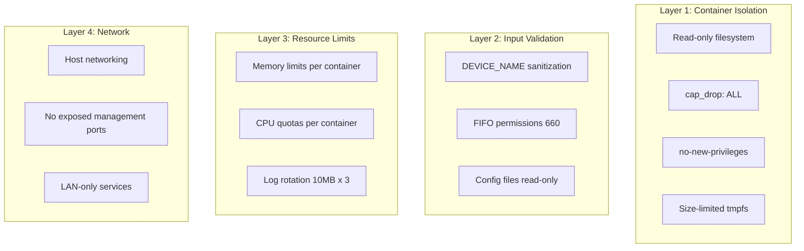

# ARC-004: Security Architecture

## Defense in Depth



## Container Security Matrix

| Service | read_only | no-new-priv | cap_drop | Runs as | AppArmor |
|---------|-----------|-------------|----------|---------|----------|
| snapserver | yes | yes | ALL (+DAC_OVERRIDE) | PUID:PGID | unconfined* |
| shairport-sync | yes | yes | ALL (+DAC_OVERRIDE) | PUID:PGID | unconfined* |
| librespot | yes | yes | ALL (+DAC_OVERRIDE) | PUID:PGID | unconfined* |
| mpd | yes | yes | ALL | PUID:PGID | default |
| mympd | yes | yes | ALL | PUID:PGID | default |
| metadata | yes | yes | ALL | PUID:PGID | default |
| tidal-connect | yes | yes | ALL (+DAC_OVERRIDE) | root** | default |
| watchtower | yes | yes | ALL | root | default |

\* `apparmor:unconfined` required for D-Bus access to Avahi
\** Tidal's proprietary binary requires root

## Input Sanitization

All user-supplied names (DEVICE_NAME, SPOTIFY_NAME, AIRPLAY_NAME, TIDAL_NAME) are sanitized:

```bash
# scripts/common/sanitize.sh
NAME=$(printf '%s' "$NAME" | tr -cd 'A-Za-z0-9 ._-')
```

This strips shell metacharacters, preventing command injection via service names.

## Secrets Management

- No secrets stored in the repository
- `.env` excluded from git (`.gitignore`)
- Spotify/Tidal authentication handled by respective apps (no stored credentials)
- Docker Hub tokens stored in GitHub Actions secrets only

## Known Exceptions

| Exception | Reason | Mitigation |
|-----------|--------|------------|
| AppArmor unconfined | D-Bus access for Avahi | Limited to 3 containers |
| Tidal runs as root | Proprietary binary requirement | read_only + cap_drop ALL + tmpfs |
| Host networking | mDNS requirement | Services bind specific ports only |
| DAC_OVERRIDE cap | Write FIFOs as non-owner | Required for FIFO I/O |
| Watchtower Docker socket | Auto-update containers | Limited to specific image labels |
