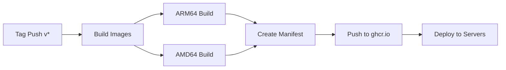

# TECH-003: Build and Deployment

## CI/CD Pipeline

### GitHub Actions Workflows

| Workflow | Trigger | Purpose |
|----------|---------|---------|
| build-push.yml | Tag push (v*) | Build and push multi-arch images |
| build-test.yml | PR | Validate Dockerfile builds |
| validate.yml | Push/PR | Shellcheck, compose syntax |
| deploy.yml | workflow_call | SSH deploy to servers |

### Build Process



## Container Registry

- **Registry**: ghcr.io (GitHub Container Registry)
- **Namespace**: lollonet/snapmulti-*
- **Tags**: latest, v0.1.0, v0.1.1, etc.

### Images

| Image | Dockerfile | Size |
|-------|------------|------|
| snapmulti-server | Dockerfile.snapserver | ~150MB |
| snapmulti-airplay | Dockerfile.shairport-sync | ~80MB |
| snapmulti-spotify | Dockerfile.librespot | ~100MB |
| snapmulti-mpd | Dockerfile.mpd | ~120MB |
| snapmulti-tidal | Dockerfile.tidal | ~80MB |

## Deployment Methods

### 1. Zero-Touch (Raspberry Pi)
```bash
# On host with SD card
./scripts/prepare-sd.sh
# Insert SD, boot Pi, wait for completion
```

### 2. Manual Deploy (Any Linux)
```bash
git clone https://github.com/lollonet/snapMULTI
cd snapMULTI
./scripts/deploy.sh
```

### 3. CI/CD Deploy
```bash
# Triggered automatically on tag push
# Or manually via GitHub Actions
```

## Quality Gates

- Shellcheck on all scripts (warning level)
- Docker Compose syntax validation
- Multi-arch build verification
- Health check validation
