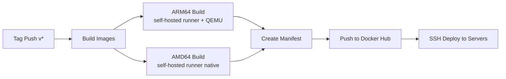

# TECH-003: Build and Deployment

## CI/CD Pipeline

### GitHub Actions Workflows

| Workflow | Trigger | Purpose |
|----------|---------|---------|
| build-push.yml | Tag push (v*) | Build and push multi-arch images |
| build-test.yml | PR | Validate Dockerfile builds |
| validate.yml | Push/PR | Shellcheck, compose syntax |
| deploy.yml | workflow_call | SSH deploy to servers |

### Build Process


```mermaid
flowchart LR
    tag[Tag Push v*] --> build[Build Images]
    build --> arm64[ARM64 Build<br/>self-hosted runner + QEMU]
    build --> amd64[AMD64 Build<br/>self-hosted runner native]
    arm64 --> manifest[Create Manifest]
    amd64 --> manifest
    manifest --> push[Push to Docker Hub]
    push --> deploy[SSH Deploy to Servers]
```

## Container Registry

- **Registry**: Docker Hub
- **Namespace**: `lollonet/snapmulti-*`
- **Tags**: `latest`, `v0.1.0`, `v0.3.3`, etc.
- **Upstream images**: go-librespot (ghcr.io), myMPD (ghcr.io)

### Images

| Image | Dockerfile | Arch | Size (arm64) |
|-------|------------|------|-------------|
| lollonet/snapmulti-server | Dockerfile.snapserver | amd64+arm64 | ~126MB |
| lollonet/snapmulti-airplay | Dockerfile.shairport-sync | amd64+arm64 | ~66MB |
| lollonet/snapmulti-mpd | Dockerfile.mpd | amd64+arm64 | ~191MB |
| lollonet/snapmulti-metadata | Dockerfile.metadata | amd64+arm64 | ~185MB |
| lollonet/snapmulti-tidal | Dockerfile.tidal | arm64 only | ~561MB |
| ghcr.io/devgianlu/go-librespot | (upstream) | amd64+arm64 | ~49MB |
| ghcr.io/jcorporation/mympd/mympd | (upstream) | amd64+arm64 | ~22MB |

## Deployment Methods

### 1. Zero-Touch (Raspberry Pi)
```bash
# On host with SD card
./scripts/prepare-sd.sh
# Insert SD, boot Pi, wait for completion
```

### 2. Manual Deploy (Any Linux)
```bash
git clone https://github.com/lollonet/snapMULTI
cd snapMULTI
./scripts/deploy.sh
```

### 3. CI/CD Deploy
```bash
# Triggered automatically on tag push
# Or manually via GitHub Actions
```

## Self-Hosted Runners

Native builds on self-hosted runners using Docker buildx with platform emulation:

| Runner | Host Architecture | Host | Container Runtime |
|--------|------------------|------|------------------|
| snapmulti-runner | amd64 | raspy (amd64 machine) | `myoung34/github-runner:ubuntu-jammy` |
| snapmulti-runner-2 | amd64 | raspy (amd64 machine) | `myoung34/github-runner:ubuntu-jammy` |
| mac-arm64-runner | arm64 | Mac (Apple Silicon) | Native (GitHub runner app) |

**Total: 3 runners** — 2 Docker containers on amd64 host (raspy) + 1 native macOS arm64 runner. Server images build on amd64 runners, client images build natively on Mac arm64 runner.

## Quality Gates

- Shellcheck on all `scripts/**/*.sh` (warning level)
- Docker Compose syntax validation (`docker compose config --quiet`)
- Multi-arch Docker build verification on PRs (build-test.yml)
- Automated Claude code review on PRs (claude-code-review.yml)
